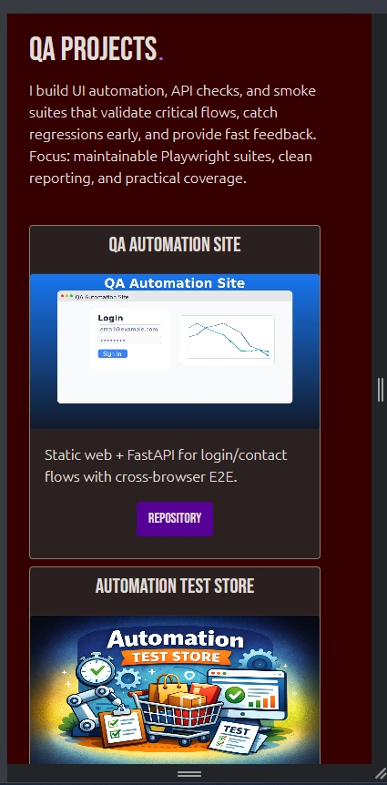
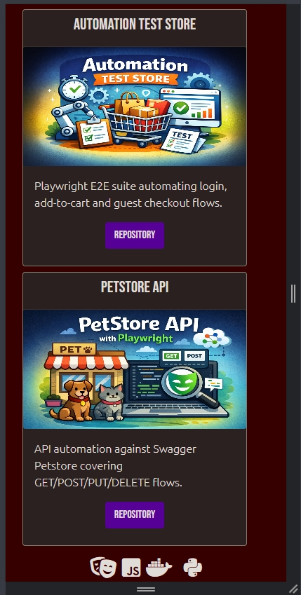

# QA Portfolio Website

Personal QA portfolio website built with Django.

This repo contains my portfolio site, including project cards, contact page, and custom styling.

## Want to copy it?
Feel free to fork or clone and adapt it to your own profile.

## Screenshots






## Run locally
```powershell
.\.venv\Scripts\python.exe manage.py runserver
```

Then open http://127.0.0.1:8000/